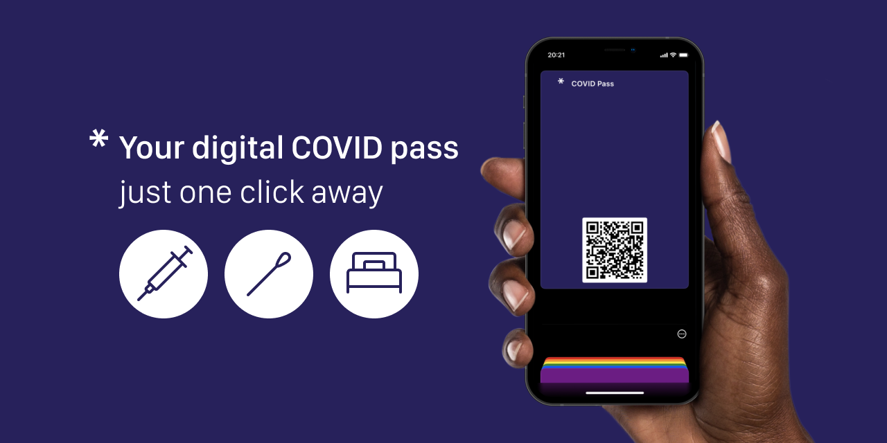

[](https://github.com/philipptrenz/covidpass/)

This web application offers the possibility to scan the EU-wide vaccination, test and recovery certificates (namely [EU Digital COVID Certificate](https://github.com/eu-digital-green-certificates/dgc-overview)) as QR code and generate an [Apple Wallet® pass](https://support.apple.com/en-us/HT204003) from it, so they are easily accessible for validation on iPhone®, and Apple Watch®.

## Discussion

Since the QR codes store sensitive personal information as well as health data, it would be ideal if Apple Wallet® passes could be generated locally by an iOS app or as a pure client-side web application. Unfortunately passes have to be signed with a valid **Pass Type ID certificate**, which requires an Apple Developer membership and therefore has to be done on a server (see [here](https://developer.apple.com/library/archive/documentation/UserExperience/Conceptual/PassKit_PG/index.html)).

Providing Apple Wallet® passes from the official COVID apps, like [Corona-Warn](https://github.com/corona-warn-app), has already been discussed and was probably already partly discarded due to security concerns and lack of specification of this requirement to developers (see [here](https://github.com/eu-digital-green-certificates/dgca-wallet-app-ios/issues/69) or [here](https://github.com/corona-warn-app/cwa-app-ios/issues/2965)).

While we very much understand these decisions for the official COVID apps, we believe that with proper education, users can assess these risks for themselves. As furthermore named [here](https://github.com/eu-digital-green-certificates/dgca-wallet-app-ios/issues/69#issuecomment-861384615), there are countless apps which can be utilized to generate Apple Wallet® passes. However, they also use external servers and it is intransparent how data, this case very sensitive data, is handled. Therefore, this project aims to create a dedicated solution that takes into account the sensitivity of the data. 
If you disagree, feel free to open an issue and let's discuss it.

## Principles

This project attempts a compromise to enable the user experience of Apple Wallet® passes while protecting sensitive information in the best possible way. For this it follows the following principles:

* Data economy
  * The sensitive data is only used in transit and never stored
  * The data are only entered in the Apple Wallet® pass without looking at their content
  * No website analytics or ad tracking 
* Transparency
  * The authors strive to be as transparent as possible
  * Within the process the user gets educated and his or her consent is required
* Open Source
  * Full source code is available
  * Code can be reviewed by third parties
  * Easy to deploy yourself (but Apple® Developer membership required)
* No commercial interests
  * Creating Apple Wallet passes is and will always be free of charge
  * Health data should never be used for profit!

## Getting started

### Add and convert certificate

Add your Pass Type ID certificate (with extension `.cer`) from the [iOS Provisioning Portal](https://developer.apple.com/ios/manage/passtypeids/index.action) to your Keychain and export as `.p12` to the `./keys` folder, named by your Pass ID (e.g. `com.example.myNewPass.p12`). Then run the following command to convert to `.pem` as well as to automatically load the needed `wwdr.pem` certificate:

```bash
./node_modules/passbook/bin/node-passbook prepare-keys -p keys
```

### Set environment variables

The following environment variables have to be set for Apple Wallet® pass generation. This can be done by an `.env` file within the project root or by adding the variables to the environment.

```bash
PASS_ORGANIZATION_NAME=  # The organization name
PASS_TYPE_IDENTIFIER=    # The Wallet Pass ID
PASS_TEAM_IDENTIFIER=    # The Developer Team identifier
PASS_CERT_SECRET=        # The .pem secret set while converting from .p12 to .pem
PASS_SERIAL_NUMBER=      # A serial number of the Apple Wallet pass
```

### Development Setup

```bash
# install dependencies
$ yarn install

# serve with hot reload at localhost:3000
$ yarn dev
```

For detailed explanation on how things work, check out [Nuxt.js docs](https://nuxtjs.org).

For testing, the QR codes from the [EU DGC test data set](https://github.com/eu-digital-green-certificates/dgc-testdata) can be used.

### Deploy with Docker Compose

```bash
# build container
$ docker-compose build  

# run container
$ docker-compose up -d  
```

Except when accessed from `localhost`, the container must be run behind a reverse proxy (e.g. nginx), which provides SSL and redirects all traffic to HTTPS!
